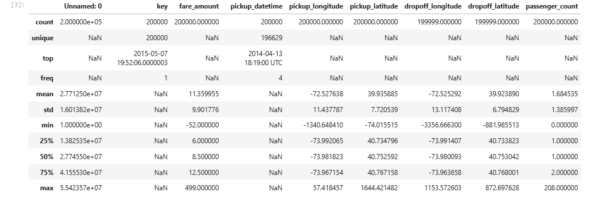
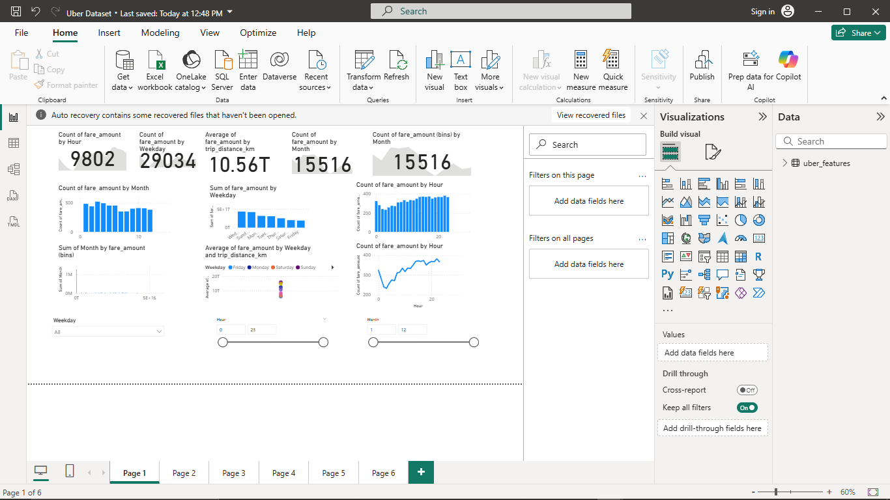

#  Uber Fares Dataset Analysis

This repository contains an in-depth analysis of Uber fare data to uncover trends, patterns, and actionable insights using **Python** and **Power BI**.

---

##  Project Overview

The primary goal of this project is to analyze Uber fare data and discover trends, patterns, and insights that can guide strategic decisions.

---

##  Tools Used

- **Python (Jupyter Notebook)**  
- **Power BI**

### Deliverables

-  Interactive Power BI dashboard (`.pbix` file)  
-  Project report (this README)  
-  Cleaned CSV dataset (`uber_cleaned.csv`)  
-  Screenshots and visualizations  
-  GitHub repository

---

## Dataset Description

- **Source**: Uber Fares Dataset from Kaggle  
- **Key Variables**:  
  - `fare_amount`  
  - `pickup_datetime`  
  - `pickup_longitude`, `pickup_latitude`  
  - `dropoff_longitude`, `dropoff_latitude`  
  - `passenger_count`  

---

##  Project Structure

---

##  Data Cleaning Methodology

Key cleaning steps:

- Removed missing or null values  
- Converted date/time fields to appropriate formats  
- Removed outliers in fare amounts and coordinates  

---

##  Exploratory Data Analysis (EDA)

Exploration involved:

- Summary statistics: mean, median, IQR, standard deviation  
- Outlier detection in fare and location coordinates  
- Data types and distributions  

  

---

##  Feature Engineering

Created new variables from `pickup_datetime`:

- Hour  
- Day  
- Month  
- Weekday  

These features added more depth to the analysis.

---

##  Export to CSV

The final processed and enriched dataset was exported for Power BI import.

- File: `uber_cleaned.csv`

---

##  Power BI – Data Import & Visualization

The cleaned dataset was visualized in Power BI to explore and communicate trends.

### Key Visualizations:

- **Fare Amount Distribution**  
  - Histogram & boxplot to detect outliers  
- **Time-Based Trends**  
  - Average fare by hour, weekday, and month  
  - Line charts for temporal patterns  
- **Interactive Filters**  
  - Slicers for weekday, month, hour  

  
  
  
  

%20vs%20fare%20bins.png)

### Dashboard Design Principles

- **Clear layout**: KPIs at top, visuals in center, filters at bottom  
- **Interactivity**: Slicers for time dimensions  
- **Consistency**: Uniform theme, fonts, and color palette  

---

##  Key Insights

- **Peak Demand**: Highest between 7–9 AM and 5–7 PM  
- **Weekday Trends**: Tuesday–Thursday are busiest days  
- **Seasonal Patterns**: Decline in rides during November–December  
- **Fare Average**: ~$11.36 per trip  
- **Total Rides**: 9,802 records analyzed  

---

##  Conclusion

The dashboard successfully visualizes Uber fare trends, time-based patterns, and distance-fare relationships. These insights are critical for operational and pricing strategies.

Future improvements may include:

- Adding weather and event datasets  
- Real-time fare prediction models

---

##  Recommendations

1. **Optimize Peak Supply**  
   Incentivize drivers during high-demand hours (7–9 AM, 5–7 PM) to reduce wait times and increase ride volume.

2. **Boost Off-Peak Demand**  
   Offer promotions during weekends and late-night hours to increase ridership.

3. **Seasonal Campaigns**  
   Plan special promotions (e.g., holiday rides, shopping discounts) to offset year-end declines.

4. **Dynamic Pricing Models**  
   Use time-of-day and distance-based insights to implement flexible pricing strategies.

5. **Dashboard Enhancements**  
   Clarify metrics and aggregation logic to avoid misinterpretation.
